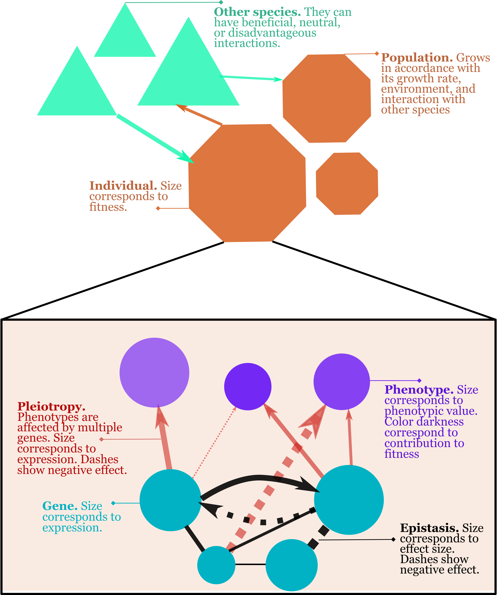

# EvoDynamics.jl Documentation

EvoDynamics.jl is a comprehensive framework designed to bridge the gap in studying biological systems at various scales. It facilitates modeling biological dynamics at both evolutionary and ecological levels, connecting genotypes to phenotypes and their interactions with the environment and other species. The framework takes into account eco-evolutionary feedbacks, which occur when the speed of evolution is rapid and populations must continuously adapt to changing conditions. These feedbacks are especially important in antagonistic interactions between species (e.g., predator-prey or parasitism), competitive interactions, and mutualistic interactions. 

#### Biological levels controlled by the model

EvoDynamics.jl enables the study of interactions at different levels, including single genes affecting single phenotypes, gene interactions, population dynamics, and species interactions. The framework features an explicit genotype-phenotype architecture (pleiotropy and epistasis), selection acting on multiple phenotypes, differential fitness contributions, arbitrary spatial structure, migration, and interacting species.

Figure below shows different biological levels controlled by the model.

See [Tutorial](@ref) for running the model, and [Model description](@ref) for a description of model parameters and simulation outline.

## Features

* Model complex food webs with various asymmetrical interactions.
* Individuals interact with one another and with the environment based on their phenotypes.
* Connect genome structure to phenotypes and populations.
* Implement a grid-based spatial structure for individual migration.
* Model a complex environment with spatio-temporally varying resources.
* Support time-varying optimal phenotypic values per site and per species.
* Allow differential contributions of traits to fitness.
* Provide the ability to remove individuals at specific times and locations.
* Model both haploid and diploid species.
* Incorporate time-variable selection strength.
* Include mutation and recombination mechanisms.
* Offer easy data collection and analysis.
* Automatically run replicates and collect data in a table.
* Run replicates in parallel for increased efficiency.
